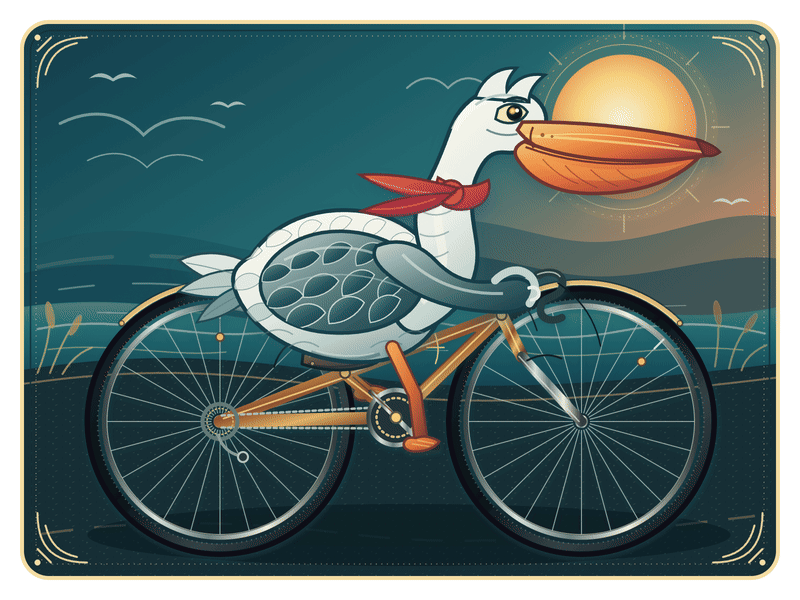
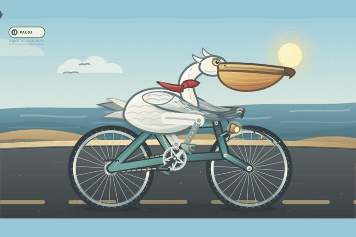
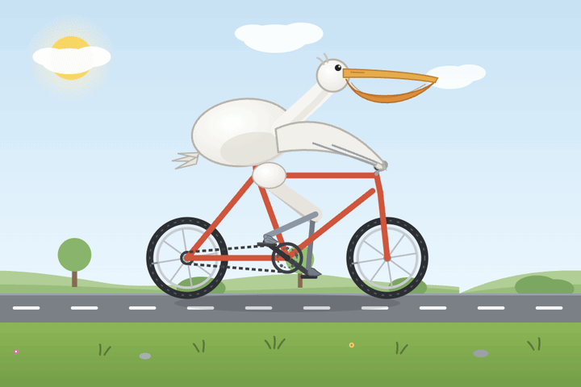

# 鹈鹕骑自行车

同一个创作命题，由不同 LLM 完成的可播放鹈鹕骑自行车 SVG 动画集合。每个版本独立保存，模型、日期和提示词都单独标注。

[打开三版本实时 SVG 展示页](./index.html)

<table align="center">
  <tr>
    <th>OpenAI GPT-5.6-sol（Max）</th>
    <th>OpenAI GPT-5.6-sol（Max）</th>
    <th>Qwen3.8-Max</th>
  </tr>
  <tr>
    <td align="center"> <code>pelican-cycling-exquisite.svg</code></td>
    <td align="center"> <code>pelican-cycling-gpt-5.6-sol-2026-07-30.svg</code></td>
    <td align="center"> <code>pelican-cycling-qwen3.8-max-2026-08-03.svg</code></td>
  </tr>
</table>

## 作品文件

- `outputs/pelican-cycling-exquisite.svg`：1600×1200 自包含动画 SVG
- `outputs/pelican-cycling-gpt-5.6-sol-2026-07-30.svg`：本次新增的 1600×900 自包含动画 SVG
- `outputs/pelican-cycling-qwen3.8-max-2026-08-03.svg`：Qwen3.8-Max 生成的 900×600 自包含动画 SVG
- `index.html`：三版本实时 SVG 展示页（适合 GitHub Pages 或本地静态服务器）
- `prompts/qwen3.8-max.md`：Qwen3.8-Max 本次使用的完整提示词
- `outputs/pelican-cycling-animated-preview.gif`：800×600 循环动画预览
- `outputs/pelican-cycling-exquisite-preview.png`：1600×1200 静态预览

动态预览位于 `previews/`：README 直接展示 GIF，`index.html` 则直接加载三个 SVG。

## 版本目录与模型标注

| 文件 | 制作模型 | 备注 |
|---|---|---|
| `outputs/pelican-cycling-exquisite.svg` | OpenAI GPT-5.6-sol（Max） | 仓库原有版本，保持不覆盖 |
| `outputs/pelican-cycling-gpt-5.6-sol-2026-07-30.svg` | OpenAI GPT-5.6-sol（Max） | 本次新增版本，模型与日期已写入文件名和 SVG metadata |
| `outputs/pelican-cycling-qwen3.8-max-2026-08-03.svg` | Qwen3.8-Max | 本次新增版本；完整提示词见 `prompts/qwen3.8-max.md` |

## 动画设计

- 1.6 秒无缝踩踏循环
- 前后踏板保持 180° 相位差
- 曲柄与车轮采用 2:1 传动关系
- 双腿使用 12 相位两段式关节轨迹
- 踏板平台在运动中保持近似水平
- 身体重心、握把翼、围巾和风尘具有不同的惯性与延迟
- 车轮反光标记随轮圈旋转，让转动方向清晰可见

## 查看方式

请使用 Chrome、Safari 或 Firefox 打开 SVG，或打开 `index.html` 查看三个实时版本。部分系统文件预览工具只会显示 SVG 的静止首帧，此时可以直接查看 `previews/` 下的 GIF 预览。

SVG 不依赖外部脚本、字体或位图资源，可以直接下载、嵌入网页或继续编辑。
