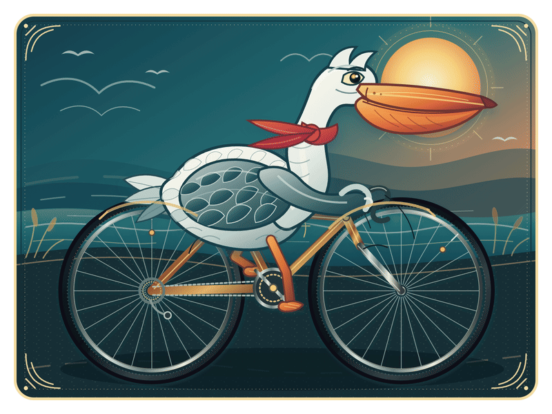

# 鹈鹕骑自行车

一只骑着复古公路自行车穿越海岸暮色的高细节动画鹈鹕。

本作品由 OpenAI GPT-5.6-sol 使用 Max 思考模式设计、绘制并完成动画编排。

  

## 作品文件

- `outputs/pelican-cycling-exquisite.svg`：1600×1200 自包含动画 SVG
- `outputs/pelican-cycling-gpt-5.6-sol-2026-07-30.svg`：本次新增的 1600×900 自包含动画 SVG
- `outputs/pelican-cycling-animated-preview.gif`：800×600 循环动画预览
- `outputs/pelican-cycling-exquisite-preview.png`：1600×1200 静态预览

## 版本目录与模型标注

| 文件 | 制作模型 | 备注 |
|---|---|---|
| `outputs/pelican-cycling-exquisite.svg` | OpenAI GPT-5.6-sol（Max） | 仓库原有版本，保持不覆盖 |
| `outputs/pelican-cycling-gpt-5.6-sol-2026-07-30.svg` | OpenAI Codex · GPT-5.6-sol | 本次新增版本，模型与日期已写入文件名和 SVG metadata |

## 动画设计

- 1.6 秒无缝踩踏循环
- 前后踏板保持 180° 相位差
- 曲柄与车轮采用 2:1 传动关系
- 双腿使用 12 相位两段式关节轨迹
- 踏板平台在运动中保持近似水平
- 身体重心、握把翼、围巾和风尘具有不同的惯性与延迟
- 车轮反光标记随轮圈旋转，让转动方向清晰可见

## 查看方式

请使用 Chrome、Safari 或 Firefox 打开 SVG。部分系统文件预览工具只会显示 SVG 的静止首帧，此时可以直接查看 GIF 预览。

SVG 不依赖外部脚本、字体或位图资源，可以直接下载、嵌入网页或继续编辑。
