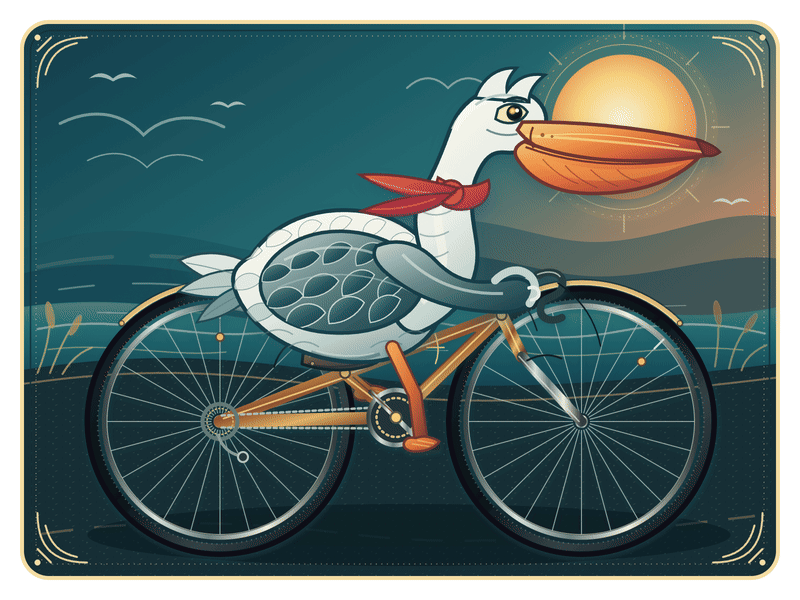
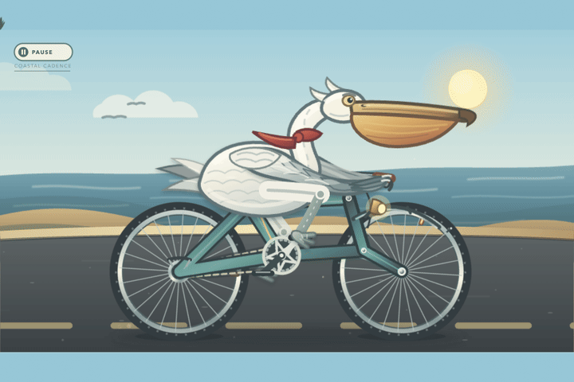
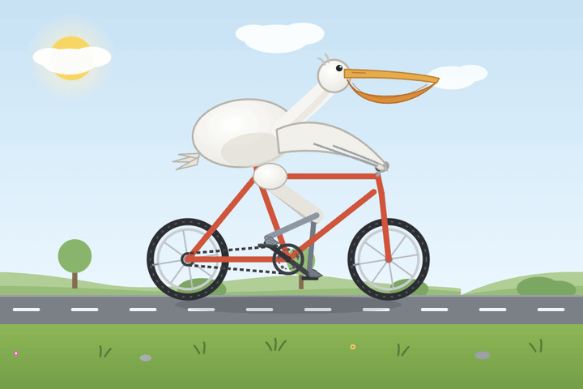
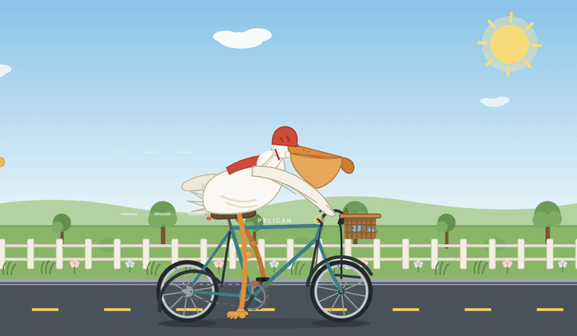
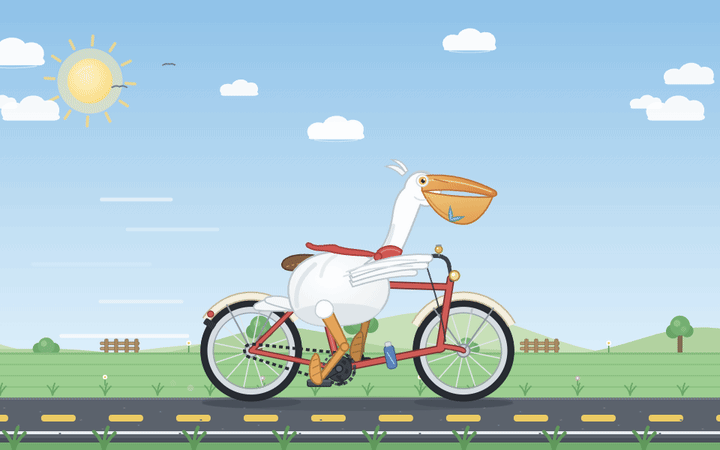
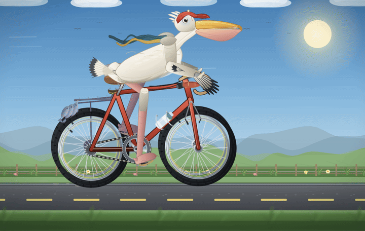
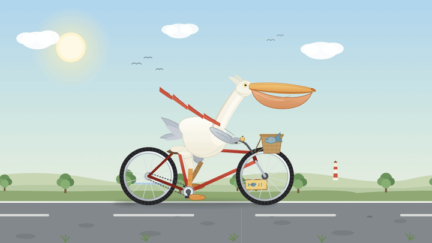
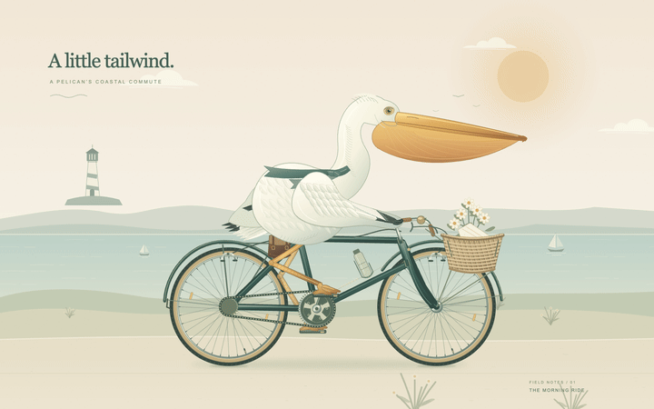

# 鹈鹕骑自行车

同一个创作命题，由不同 LLM 完成的可播放鹈鹕骑自行车 SVG 动画集合。每个版本独立保存，模型、日期和提示词都单独标注。

[打开九版本实时 SVG 展示页](./index.html)

<table align="center">
  <tr>
    <th>OpenAI GPT-5.6-sol（Max）</th>
    <th>OpenAI GPT-5.6-sol（Max）</th>
  </tr>
  <tr>
    <td align="center"> <code>pelican-cycling-exquisite.svg</code></td>
    <td align="center"> <code>pelican-cycling-gpt-5.6-sol-2026-07-30.svg</code></td>
  </tr>
  <tr>
    <th>Qwen3.8-Max</th>
    <th>Qwen3.8-27B-8bit</th>
  </tr>
  <tr>
    <td align="center"> <code>pelican-cycling-qwen3.8-max-2026-08-03.svg</code></td>
    <td align="center"> <code>pelican-cycling-qwen3.8-27b-8bit-2026-08-15.svg</code></td>
  </tr>
  <tr>
    <th>ZCode · GLM5.3</th>
    <th>ZCode · Qwen3.8-Flash</th>
  </tr>
  <tr>
    <td align="center"> <code>pelican-cycling-glm5.3-2026-08-16.svg</code></td>
    <td align="center"> <code>pelican-cycling-qwen3.8-flash-2026-08-29.svg</code></td>
  </tr>
  <tr>
    <th colspan="2">ZCode · step-5-preview</th>
  </tr>
  <tr>
    <td colspan="2" align="center"> <code>pelican-cycling-step-5-preview-2026-09-20.svg</code></td>
  </tr>
  <tr>
    <th colspan="2">LongCat-2.5-Preview</th>
  </tr>
  <tr>
    <td colspan="2" align="center"> <code>pelican-cycling-longcat-2.5-preview-2026-09-26.svg</code></td>
  </tr>
  <tr>
    <th colspan="2">GPT-6.1-sol</th>
  </tr>
  <tr>
    <td colspan="2" align="center"> <code>pelican-cycling-gpt-6.1-sol-2026-09-30.svg</code></td>
  </tr>
</table>

## 作品文件

- `outputs/pelican-cycling-exquisite.svg`：1600×1200 自包含动画 SVG
- `outputs/pelican-cycling-gpt-5.6-sol-2026-07-30.svg`：本次新增的 1600×900 自包含动画 SVG
- `outputs/pelican-cycling-qwen3.8-max-2026-08-03.svg`：Qwen3.8-Max 生成的 900×600 自包含动画 SVG
- `outputs/pelican-cycling-qwen3.8-27b-8bit-2026-08-15.svg`：Qwen3.8-27B-8bit 生成的 1200×700 自包含动画 SVG
- `outputs/pelican-cycling-glm5.3-2026-08-16.svg`：ZCode · GLM5.3 生成的 960×600 自包含动画 SVG
- `outputs/pelican-cycling-qwen3.8-flash-2026-08-29.svg`：ZCode · Qwen3.8-Flash 生成的 1200×760 自包含动画 SVG（96 帧 IK 求解，3.2 秒无缝循环）
- `outputs/pelican-cycling-step-5-preview-2026-09-20.svg`：ZCode · step-5-preview 生成的 1280×720 自包含动画 SVG
- `outputs/pelican-cycling-longcat-2.5-preview-2026-09-26.svg`：LongCat-2.5-Preview 生成的 1280×720 动态 SVG
- `outputs/pelican-cycling-gpt-6.1-sol-2026-09-30.svg`：GPT-6.1-sol 生成的 1600×1000 原生 SMIL 动画 SVG
- `index.html`：九版本实时 SVG 展示页（适合 GitHub Pages 或本地静态服务器）
- `prompts/qwen3.8-max.md`：Qwen3.8-Max 本次使用的完整提示词
- `outputs/pelican-cycling-animated-preview.gif`：800×600 循环动画预览
- `outputs/pelican-cycling-exquisite-preview.png`：1600×1200 静态预览

动态预览位于 `previews/`：README 直接展示 GIF，`index.html` 则直接加载九个 SVG。

## 版本目录与模型标注

| 文件 | 制作模型 | 备注 |
|---|---|---|
| `outputs/pelican-cycling-exquisite.svg` | OpenAI GPT-5.6-sol（Max） | 仓库原有版本，保持不覆盖 |
| `outputs/pelican-cycling-gpt-5.6-sol-2026-07-30.svg` | OpenAI GPT-5.6-sol（Max） | 本次新增版本，模型与日期已写入文件名和 SVG metadata |
| `outputs/pelican-cycling-qwen3.8-max-2026-08-03.svg` | Qwen3.8-Max | 本次新增版本；完整提示词见 `prompts/qwen3.8-max.md` |
| `outputs/pelican-cycling-qwen3.8-27b-8bit-2026-08-15.svg` | Qwen3.8-27B-8bit | 本次新增版本；模型与日期已写入文件名和 SVG metadata |
| `outputs/pelican-cycling-glm5.3-2026-08-16.svg` | ZCode · GLM5.3 | 本次新增版本；模型与日期已写入文件名和 SVG metadata |
| `outputs/pelican-cycling-qwen3.8-flash-2026-08-29.svg` | ZCode · Qwen3.8-Flash | 本次新增版本；由 qwen3.8-flash 制作，消耗 4300 万 token，用时 1 小时 45 分钟，API 金额消费 5 元；模型自我总结见下方「制作备注」与 SVG metadata |
| `outputs/pelican-cycling-step-5-preview-2026-09-20.svg` | ZCode · step-5-preview | 本次新增版本；模型与日期已写入 SVG 描述和文件名 |
| `outputs/pelican-cycling-longcat-2.5-preview-2026-09-26.svg` | LongCat-2.5-Preview | 本次新增版本；模型与日期已写入 SVG 描述和文件名 |
| `outputs/pelican-cycling-gpt-6.1-sol-2026-09-30.svg` | GPT-6.1-sol | 本次新增版本；模型、日期和版本标识已写入 SVG metadata |

## 制作备注（Qwen3.8-Flash 版）

由 qwen3.8-flash 制作：消耗 4300 万 token，用时 1 小时 45 分钟，API 金额消费 5 元。以下是该模型完成后的自我总结：

> 完成。动画已构建、经真实播放验证，并已保存。
> 交付物：`/Users/lidazuo/.zcode/workspace/default/pelican-cyclist.svg` —— 1200×760，纯 SMIL（不含 JavaScript），约 600 KB。直接双击以文件方式打开、用 `` 嵌入、或内联进页面，三种方式都会动。生成脚本：`build/build.py`（运行 `python3 build/build.py` 即可重新生成）。
> 制作方式：没有手绘动作，而是写了一个小型仿射变换 + 两骨节逆运动学（IK）引擎，在构建时运行，每条通道输出 96 个关键帧。四条肢体每帧都是求解出来的，所以蹼足焊死在脚踏上、翼尖焊死在弯把上是构造上的必然，而不是画出来的近似。一个 3.2 秒的主周期恰好包含 2 圈曲柄、5 圈车轮，以及每个视差图层整数倍的贴图宽度，因此循环闭合、没有接缝。滚动在物理上自洽：地面卷动速度等于轮圈表面速度（1158.5 px/s），2.5 的齿比是真实的，脚踏还会反向旋转以保持水平。次级运动——喉囊形变、三条行波丝巾、尾羽摆动、枕部冠羽颤动、眨眼、髋部驱动、车把倾斜、扬尘——全部运行在能整除主周期的频率上。
> 检查方式：均匀抽样 16 帧定位帧；对整个循环做 40 帧的确定性遍历（无停顿、无跳变；接缝步长 8.06 对平均 7.11，即接缝不可见）；真实时间下的实时捕获；逐区域运动量分析，证明没有任何部件是冻结的；以及一次正向运动学（FK）复演，按浏览器的方式重新合成输出的各关节角度——在全部 96 个关键帧、左右两侧上，足对脚踏、手对车把的最差残差为 0.0000 px。
> 迭代中修复的问题：近侧翅膀锚在了画布原点（飘在天上）；尾羽的旋转支点写错（完全看不见）；脚部旋转差了 90°，脚趾朝下而不是平踩在脚踏上；远侧腿被轮胎、轮圈和链条遮挡后切成三段，看起来像截肢；车座被腹部吞掉，骑手像是坐在上管上；尾包被误读成一个空车座；羽毛画成了尖刺状的手摇扇；三级飞羽以灰色出现在翅膀前缘，看起来像一处杂笔；"鸡翅膀"式高抬的肘部；以及脚踏反向旋转多算了 180°。还抓到自己在校验过期渲染——曲柄图表的工具缓存了一份旧的 SVG，导致复核的是旧画面；已重写为每次运行都重新读取文件。
> 一轮独立的视觉评审对 8 相位曲柄图表给出通过，两只脚在每个角度都跟住脚踏。全帧图上两条"重大"结论（脚踏不是 180° 对置、后三角里有一只悬空的脚）与 FK 计算矛盾，于是对渲染像素做了取样：远侧脚正好落在其预测的脚踏坐标上，而被指为"悬空脚"的那个位置是背景天空——属于误判，不是缺陷。
> 已知局限：这是风格化的侧视图，所以远侧腿画在近侧车轮的轮圈之前而不是之后（藏在后面会完全不可读）；翅膀覆羽是示意性处理，没有逐根画出羽枝。

## 动画设计

- 1.6 秒无缝踩踏循环
- 前后踏板保持 180° 相位差
- 曲柄与车轮采用 2:1 传动关系
- 双腿使用 12 相位两段式关节轨迹
- 踏板平台在运动中保持近似水平
- 身体重心、握把翼、围巾和风尘具有不同的惯性与延迟
- 车轮反光标记随轮圈旋转，让转动方向清晰可见

## 查看方式

请使用 Chrome、Safari 或 Firefox 打开 SVG，或打开 `index.html` 查看九个实时版本。部分系统文件预览工具只会显示 SVG 的静止首帧，此时可以直接查看 `previews/` 下的 GIF 预览。

SVG 不依赖外部脚本、字体或位图资源，可以直接下载、嵌入网页或继续编辑。
